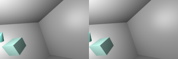
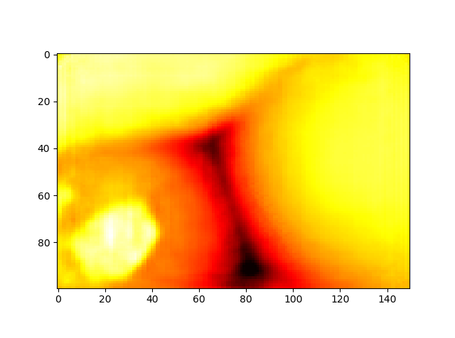

# StereoConvNet_Keras
Implementation of StereoConvNet in Keras

This method is suggested by Louis Foucard. You can reach the original version <a href="https://github.com/LouisFoucard/StereoConvNet">here</a>

Download the dataset from the link below:

<a href="https://github.com/LouisFoucard/DepthMap_dataset">DepthMap_dataset</a>

Input stereo images:

Ground truth:

Here are the result after 1000 epochs:

